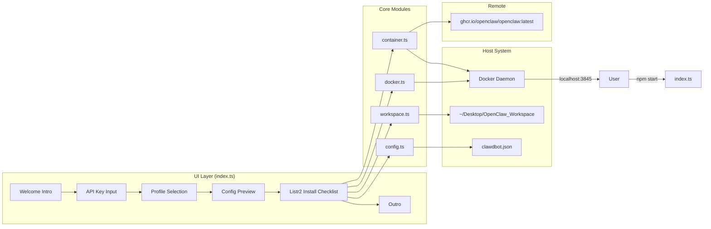

# Architecture — One-Click Claw

## System Diagram



---

## Installation Flow (7 Steps)

```
1. Welcome UI         — @clack/prompts intro with cyan banner
2. API Key Input      — p.password(), masked, inline confirmation
3. Profile Selection  — p.select(), 4 profiles, inline confirmation
4. Config Preview     — syntax-highlighted JSON via picocolors
5. Docker Check       — checkDocker() → install via Homebrew if missing → startDockerDaemon()
6. Workspace Setup    — mkdir ~/Desktop/OpenClaw_Workspace (idempotent)
7. Config + Container — generateConfig() writes clawdbot.json; pullContainerImage() + launchContainer()
```

---

## Component Responsibilities

| Module | File | Responsibility |
|---|---|---|
| Entry / UI | `src/index.ts` | Orchestrates all prompts, listr2 checklist, error handling |
| Types | `src/types.ts` | `SecurityProfileKey`, `SandboxMode`, `WorkspaceAccess`, `ClawdbotConfig` |
| Profiles | `src/profiles.ts` | Static config map for all 4 security profiles |
| Config | `src/config.ts` | Serialises profile + API key → `clawdbot.json` on disk |
| Docker | `src/docker.ts` | Detection (`docker --version`), Homebrew install, daemon poll |
| Workspace | `src/workspace.ts` | `mkdir -p ~/Desktop/OpenClaw_Workspace` via execa |
| Container | `src/container.ts` | `docker pull` + `docker run` with scoped volume mount |

---

## Data Flow

```
User input (apiKey, profileKey)
         │
         ▼
    profiles.ts ──► ClawdbotConfig object
         │
         ▼
    config.ts ──► clawdbot.json written to ~/Desktop/OpenClaw_Workspace
         │
         ▼
    container.ts ──► docker run
                      --volume ~/Desktop/OpenClaw_Workspace:/workspace
                      --env ANTHROPIC_API_KEY=<apiKey>
                      --publish 3845:3845
                      ghcr.io/openclaw/openclaw:latest
```

---

## Security Boundary

The container has access to **only** `~/Desktop/OpenClaw_Workspace` via a scoped volume mount. The host filesystem, home directory, and system paths are never exposed. The API key is passed as a runtime env var — it is never written to disk on the host.

---

## Tech Stack

| Layer | Choice | Reason |
|---|---|---|
| Language | TypeScript + ESModules | Type safety; native module resolution |
| Terminal UI | `@clack/prompts` | Connected-line UX matching Astro/Vercel CLIs |
| Colors | `picocolors` | Minimal, fast, high-contrast |
| Task runner | `listr2` | Sequential spinner checklist with real-time updates |
| Shell execution | `execa` | Safe subprocess management; no shell injection surface |
| Runtime | `tsx` (dev) / `tsc` (build) | Zero-config TypeScript execution |
